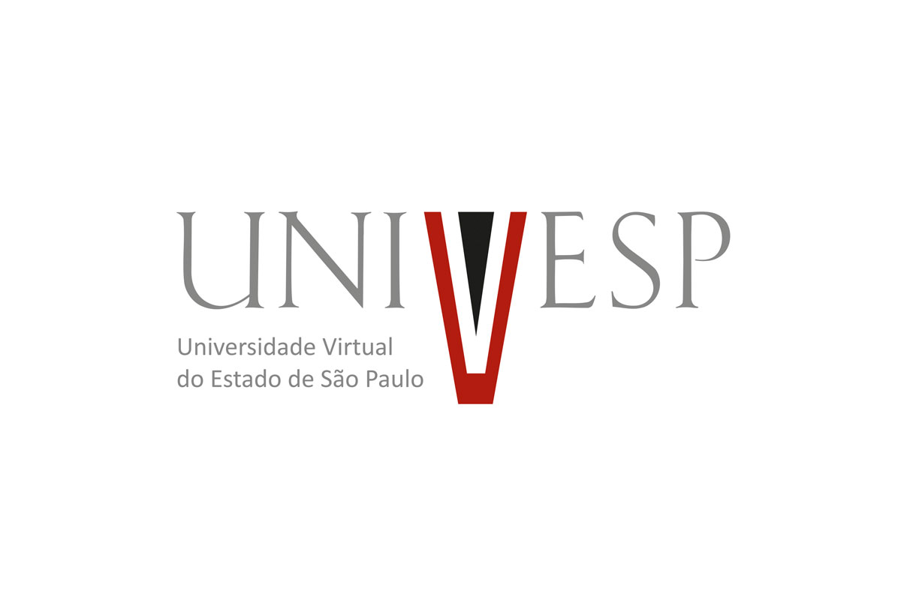

# Sistema para Oficina Mecânica

Repositório do App para o Projeto Integrador II - Eixo Computação - UNIVESP.

## Sobre o Projeto

Este projeto consiste em um **Sistema Web de Gestão para Oficinas Mecânicas**, com o objetivo de organizar o dia a dia da oficina, permitindo o controle de:
- Usuários do sistema;
- Clientes;
- Veículos e seus vínculos com os clientes.

## Tecnologias

- **Backend:** Django (Python), com banco de dados via migrations.
- **Frontend:** Templates Django + JavaScript.
- **Banco de Dados:** SQLite (ambiente de desenvolvimento).

## Como Executar Localmente

```bash
# criar e ativar o ambiente virtual
python -m venv venv
./venv/Scripts/activate      # Windows
source venv/bin/activate     # Linux/Mac

# instalar dependências
pip install -r requirements.txt

# aplicar as migrations
python manage.py migrate

# criar um usuário administrador
python manage.py createsuperuser

# rodar o servidor
python manage.py runserver
```

Acesse `http://127.0.0.1:8000/login/` para entrar no sistema.

## Funcionalidades Principais

- **Login e Autenticação:** Acesso ao sistema por usuário e senha.
- **Cadastro de Usuários:** Gestão de contas de acesso ao sistema (restrito a administradores).
- **Cadastro de Clientes:** Registro dos dados dos clientes da oficina.
- **Cadastro de Veículos:** Registro dos veículos, vinculados aos respectivos clientes.

## Autores

Projeto desenvolvido pelos alunos da Universidade Virtual do Estado de São Paulo (UNIVESP):
- Nicole Cristine da Silva Cota
- Renan Souza Oliveira
- Pedro Henrique Oliveira de Souza
- Emilly Soares Moitinho
- Matheus Santos Moitinho
- Fabiano Inácio
- João Vitor Chaves Romão de Souza

**Tutor(a):** Marco Tulio Vilela Bueno Jardim
**Ano:** 2026


